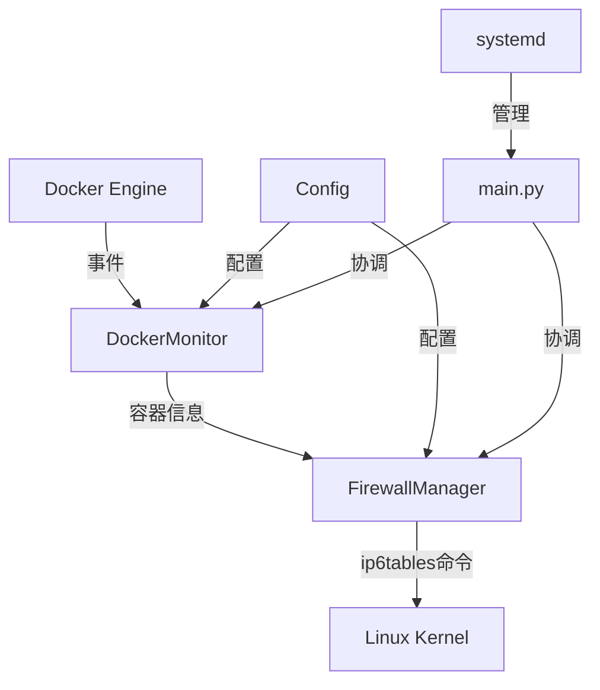

# Docker IPv6 Firewall Manager - 技术架构文档

## 概述

Docker IPv6 Firewall Manager 是一个专门为 Docker 容器自动管理 IPv6 防火墙规则的系统服务。它通过监控 Docker 事件，自动为容器创建和删除相应的 IPv6 转发规则。

## 核心设计理念

### 防火墙策略逻辑

**当前实现的防火墙策略是专门针对 macvlan 网络架构的特定转发场景：**

```
外网 (Internet) 
    ↓
物理接口 (parent_interface: ens3)
    ↓
macvlan网关 (gateway_macvlan: macvlan_gw)  
    ↓
Docker容器 (macvlan网络中的容器)
```

### 规则生成逻辑

1. **基础转发规则**（双向）：
   ```bash
   # 允许从 macvlan_gw 到 ens3 的转发（容器访问外网）
   ip6tables -A DOCKER_IPV6_FORWARD -i macvlan_gw -o ens3 -j ACCEPT
   
   # 允许从 ens3 到 macvlan_gw 的转发（外网访问容器）
   ip6tables -A DOCKER_IPV6_FORWARD -i ens3 -o macvlan_gw -j ACCEPT
   ```

2. **容器特定规则**（针对暴露端口）：
   ```bash
   # 允许外网通过特定端口访问容器
   ip6tables -A DOCKER_IPV6_FORWARD -p tcp -d <容器IPv6地址> --dport <端口> -i ens3 -o macvlan_gw -j ACCEPT
   ```

### 关键限制

⚠️ **重要**：当前实现仅适用于以下网络架构：
- 使用 macvlan 网络的 Docker 容器
- 有明确的物理接口和 macvlan 网关接口
- 需要从外网访问容器服务的场景

### Swarm 集群适配

针对 Docker Swarm 环境，系统实现了以下适配逻辑：

1. **工作节点降级 (Worker Degrade)**:
    - 无法访问管理平面 API (docker service inspect) 时，自动回退。
    - 采用 "Local Discovery" 机制，扫描本地容器及其 Label (`com.docker.swarm.service.*`)。

2. **冲突解决 (Conflict Resolution - Exclusive Mode)**:
    - **问题**: 原生 PortBinding 与自定义 Label 可能冲突。
    - **策略**: 标签优先 (Label Priority)。如果存在 `docker-ipv6-firewall.ports` 标签，则完全忽略原生端口映射。


## 系统架构

### 模块组成

```
docker-ipv6-firewall/
├── src/
│   ├── main.py              # 主服务程序，服务生命周期管理
│   ├── docker_monitor.py    # Docker事件监控和容器信息解析
│   ├── firewall_manager.py  # IPv6防火墙规则管理核心
│   └── config.py           # 配置文件管理
├── config/
│   └── config.yaml         # 默认配置文件
├── systemd/
│   └── docker-ipv6-firewall.service  # systemd服务定义
└── debian/                 # Debian包构建文件
```

### 数据流



### 核心工作流程

1. **服务启动**：
   - 加载配置文件
   - 初始化防火墙链 `DOCKER_IPV6_FORWARD`
   - 添加基础转发规则
   - 处理现有运行中的容器

2. **容器启动事件**：
   - 监听 Docker 事件 API
   - 获取容器 inspect 信息
   - 解析端口暴露配置 (`ExposedPorts`)
   - 提取 IPv6 网络信息 (`GlobalIPv6Address`)
   - 生成并添加防火墙规则

3. **容器停止事件**：
   - 监听容器停止/删除事件
   - 查找对应的防火墙规则
   - 删除相关规则

## 配置系统

### 核心配置项

```yaml
# 网络接口配置（必需）
parent_interface: ens3        # 物理网络接口
gateway_macvlan: macvlan_gw   # macvlan网关接口

# 防火墙配置
chain_name: DOCKER_IPV6_FORWARD  # 自定义链名称

# 监控配置
monitored_networks:           # 监控的网络类型
  - macvlan
  - bridge

# 日志配置
log_level: INFO
log_file: /var/log/docker-ipv6-firewall.log
```

### 配置说明

- `parent_interface`: 物理网络接口，通常是服务器的主网卡
- `gateway_macvlan`: macvlan网关接口，Docker macvlan网络的网关
- `monitored_networks`: 只有在这些网络类型中的容器才会被处理

## 安全考虑

### 权限要求
- 需要 root 权限运行（操作 iptables）
- 需要访问 Docker socket
- 需要网络管理权限

### 安全特性
- 规则重复检查，避免重复添加
- 容器停止时自动清理规则
- 只处理配置中指定的网络类型
- 详细的日志记录便于审计

### 潜在风险
⚠️ **注意**：基础转发规则会允许 macvlan 网络中的所有流量双向转发，这可能带来安全风险。建议：
- 仔细配置网络接口
- 定期审计防火墙规则
- 监控服务日志

## 扩展性

### 支持的网络类型
当前支持：
- macvlan 网络
- bridge 网络（有 IPv6 地址的）

### 未来扩展方向
- 支持更多网络驱动
- 支持 IPv4 规则管理
- 支持更复杂的规则策略
- 支持规则模板配置

## 故障排除

### 常见问题

1. **规则未生效**
   - 检查容器是否在监控的网络类型中
   - 检查容器是否有 IPv6 地址
   - 检查容器是否有暴露端口

2. **服务启动失败**
   - 检查 Docker 服务状态
   - 检查配置文件语法
   - 检查权限设置

3. **规则重复**
   - 服务有内置的重复检查机制
   - 如果发现重复，检查是否有其他程序在操作同一链

### 调试命令

```bash
# 查看服务状态
systemctl status docker-ipv6-firewall

# 查看实时日志
journalctl -u docker-ipv6-firewall -f

# 查看防火墙规则
ip6tables -L DOCKER_IPV6_FORWARD -n -v

# 测试配置文件
python3 -c "import yaml; print(yaml.safe_load(open('/etc/docker-ipv6-firewall/config.yaml')))"
```

## 性能特征

- **内存使用**：约 30-50MB
- **CPU 使用**：事件驱动，平时几乎无 CPU 消耗
- **响应时间**：容器启动后 1-2 秒内添加规则
- **规则数量**：理论上无限制，实际受系统 iptables 性能影响
